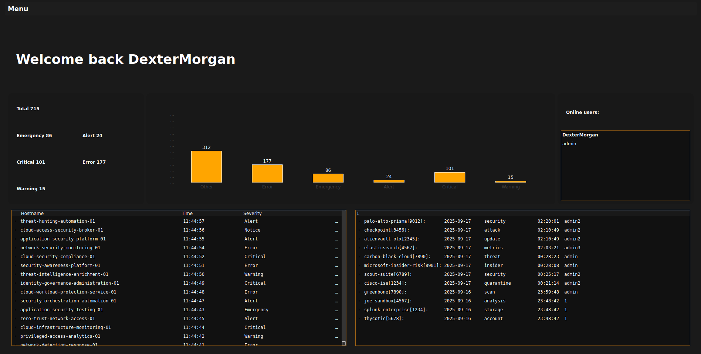

# SIEMonitor


A lightweight Security Information and Event Management (SIEM) platform built in C++ with a Qt6 GUI, designed for real-time log collection, processing, and security monitoring, created for educational purposes.

## 🏗️ Architecture

SIEMonitor follows a client-server architecture with specialized components for comprehensive security monitoring:

### Server Component
- **Syslog Server**: Receives and processes syslog messages on port 1514
- **Client Server**: Handles GUI client connections and data requests on port 12345
- **Database Layer**: SQLite3-based log storage with multi-threaded writers
- **Command Handler**: Processes client requests for log data and analytics

### Client Component
- **Qt6 GUI Application**: Modern interface with multiple windows (login, connection, SIEM dashboard)
- **Real-time Updates**: Live log monitoring with background worker threads
- **Log Analysis**: Advanced log parsing and filtering capabilities
- **Network Communication**: TCP-based communication with the server
- **IP Geolocation Mapping**: Visualize suspicious IP addresses on a map

## 📁 Full Project Structure

```
SIEMonitor/
├── server/                             
│   ├── src/
│   │   ├── main.cpp                    
│   │   ├── network/
│   │   │   ├── ServerSyslog.h          
│   │   │   ├── ServerClient.h         
│   │   │   ├── syslog_connections/
│   │   │   |   ├── Authentication/
│   │   │   |   |   ├──AuthService.h
│   │   │   |   |   └──BCript.h
│   │   │   │   └── SyslogListener.h    
│   │   │   └── clients_connections/
│   │   │       └── ClientListener.h    
│   │   ├── command_handler/
│   │   │   ├─── CommandHandler.h
│   │   │   └── commands/
│   │   │       ├── ListHosts.hpp
│   │   │       ├── OnlineUsers.hpp
│   │   │       ├── UpdateData.hpp
│   │   │       └── LogsData.hpp        
│   │   ├── log_parser/
│   │   |   ├── GetIpLocation.hpp   
│   │   │   └── LogDatabaseWriter.h     
│   │   └── utils/
│   │       ├── ThreadSafeQueue.h       
│   │       ├── ProtocolHandler.h 
│   │       ├── SplitText.h       
│   │       └── DBComandExecutor.h      
│   ├── makefile                       
│   └── target/                 
├── client/ 
│   ├── src/
│   │   ├── main.cpp 
│   │   ├── frontend/
│   │   │   ├── gui.h   
│   │   │   ├── gui.cpp            
│   │   │   └── window/
│   │   │       ├── home_screen/
│   │   │       ├── incidents_screen/
│   │   │       ├── analytics_screen/
│   │   │       ├── search_screen/          #Not implemented yet
│   │   │       ├── threat_screen/          #Not implemented yet
│   │   │       ├── siem.h            
│   │   │       ├── login.hpp      
│   │   │       ├── siem.h           
│   │   │       └── ip_connect.hpp     
│   │   └── backend/
│   │       ├── ServerConnection.h    
│   │       ├── UpdateWorker.h         
│   │       ├── SplitLogs.hpp          
│   │       ├── SplitLogs.cpp         
│   │       └── Utils.hpp              
│   └── makefile                       
├── LICENSE                   

```
## Preview




## ✨ Key Features

### Real-time Log Processing
- **Syslog Protocol Support**: Standard RFC3164 syslog message reception
- **Multi-threaded Processing**: 4 worker threads for concurrent log writing
- **Thread-safe Queue**: Efficient message queuing between components
- **SQLite3 Storage**: Persistent log storage with optimized queries

### Advanced Log Analysis
- **Severity-based Filtering**: Filter logs by severity levels
- **Host and Source Tracking**: Monitor specific hosts and log sources
- **Search Capabilities**: Full-text search across log messages
- **Resolution Tracking**: Mark and track resolved security incidents

### Modern GUI Interface
- **Multi-window Design**: Separate windows for connection, login, and monitoring
- **Real-time Updates**: Live log streaming with automatic refresh
- **Stacked Widget Layout**: Smooth transitions between different views
- **Responsive Design**: Maximized dashboard for comprehensive monitoring

### Network Architecture
- **TCP Communication**: Reliable client-server communication
- **Protocol Handling**: Custom protocol 
- **Background Processing**: Non-blocking UI with worker threads

## 🔧 Prerequisites

### Server Dependencies
```bash
    git clone https://github.com/rg3/bcrypt
    sudo apt install sqlite3 libsqlite3-dev
    sudo apt-get install libmaxminddb-dev
```

### Client Dependencies
```bash
    moc- sudo apt install qt6-base-dev
    sudo apt-get install qt6-base-dev
```

### Build Requirements
- **C++20 Compiler**: GCC with C++20 support
- **Make**: Build system
- **SQLite3**: Database engine
- **MaxMinddb**: GeoLite2-City.mmdb
- **Qt6**: GUI framework
- **bcrypt**: Password hashing library


## 📖 Usage

### Starting the Server
```bash
cd server
./target/program
```
The server will:
    -Thread Quere
    -Start SyslogListener
    -Start writing log in DataBase
    -Start Syslog server
    -[INFO] Server listen at 1514
    -ClientListenerServer start
    -Server TCP for clients listen at 12345...

### Launching the Client
```bash
cd client
./target/program
```

The client provides:
1. **Server Connection Window**: Configure server IP and port
2. **Login Window**: User authentication
3. **SIEM Dashboard**: Real-time monitoring and log analysis

### Log Data Queries
The system supports various log queries:
- Filter by severity, host, source
- Search log messages
- Track resolved incidents
- Generate statistics and reports
- Map suspicious IP locations on a map 

## 🔒 Security Features

- **Bcrypt Password Hashing**: Secure user authentication
- **Thread-safe Operations**: Concurrent access protection

## 📊 Performance

- **Multi-threaded Processing**: Concurrent log writing with 4 worker threads
- **Efficient Queuing**: Thread-safe queue for high-throughput processing
- **Optimized Database**: SQLite3 with indexed queries for fast retrieval
- **Lightweight Design**: Minimal resource footprint

## 📝 License

This project is licensed under the GNU General Public License v3.0 - see the [LICENSE](LICENSE) file for details.

